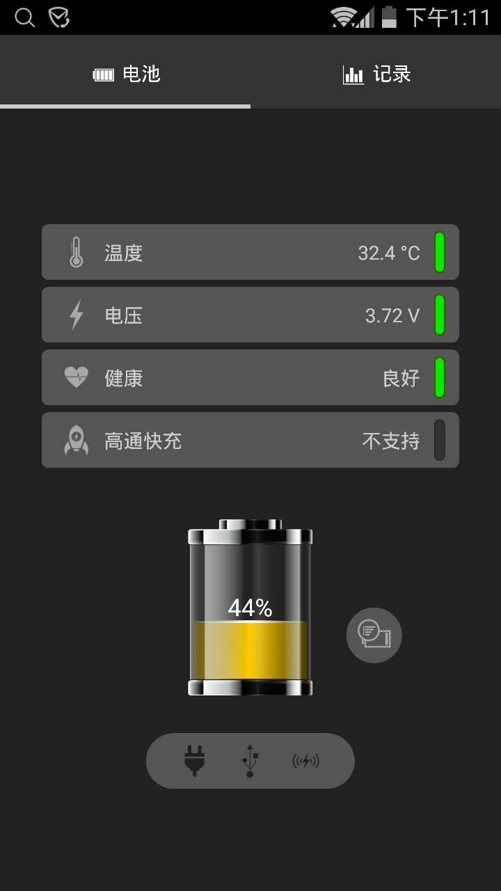
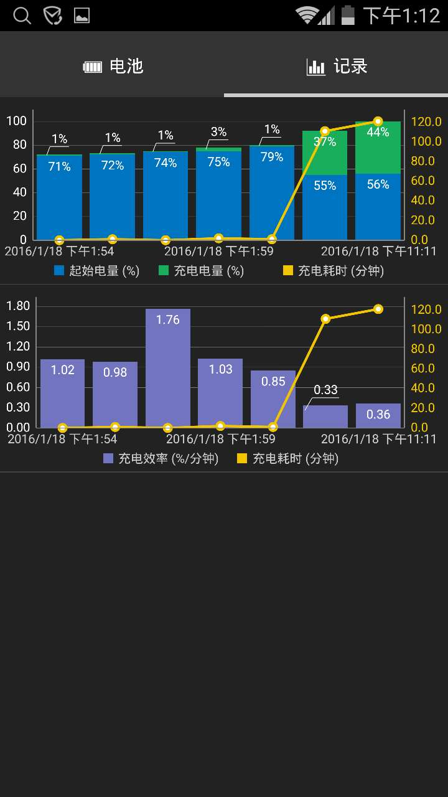

# Battery

Battery is a native Android application for showing battery status and charge log.
The battery image design originated from [shutterstock](https://www.shutterstock.com), 
and based on the original design, the similar battery graphics parts will be drawn and
animated on mobile screen.

Look the following result, so pretty, huh!

